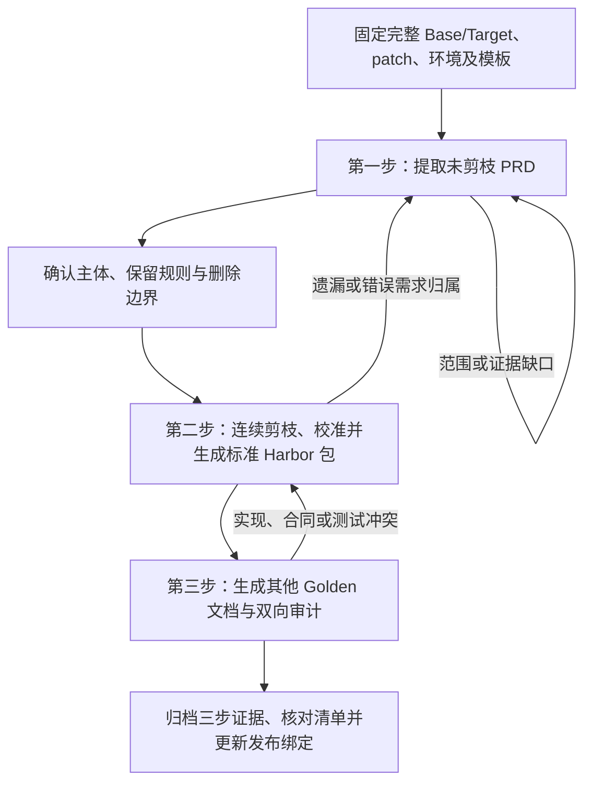

# 通用 case 制作 workflow

本目录集中管理用于批量制作 case 的 workflow。各流程并列存放，通过冻结产物和明确的数据契约交接。

```text
case_preparation/
├── reverse_extraction/     # 第一步：反向提取完整、未剪枝 PRD
├── feature_pruning/        # 第二步：功能剪枝与标准 Harbor 包生成
└── golden_documents/       # 第三步：其他 Golden 文档生成与双向审计
```

| 顺序 | 入口 | 交付 |
| --- | --- | --- |
| 1 | [reverse_extraction/](reverse_extraction/README.md) | 完整 PRD、需求追踪和完整性审计 |
| 2 | [feature_pruning/](feature_pruning/README.md) | 最终范围、剪枝 patch、测试校准和标准 Harbor 包 |
| 3 | [golden_documents/](golden_documents/README.md) | 技术设计、接口合同、完整目标描述、测试设计和双向审计 |

执行记录写入各 case 的独立运行目录，最终随 Harbor 包归档；本目录保存通用规则和空模板。

## 执行流程总览



同一 case 按第一步 → 第二步 → 第三步推进。每一步执行内部全部阶段及检查，不需要靠下一条聊天消息推进内部阶段。输入错配或实质产品决定缺失时登记阻塞，继续可独立完成的工作；有问题返回最早受影响阶段，修正后重新核验下游产物。

## 0. 准备一次 case 运行

1. 分配稳定 `case_id`；每步使用独立 `run_id` 和运行目录。修订时保存明确父版本，不覆盖已冻结记录。
2. 固定完整生产基线、完整未剪枝目标、生产/测试差异、环境适配及可读源码或恢复方法。路径相近、版本标签相同或历史评分通过都不能代替身份核验。
3. 将对应步骤的 `templates/inputs.json` 复制到运行目录，填写真实路径、哈希、能力与模板；替换占位符，区分未提供、未核验和已确认。
4. 执行者读取该步骤的 `workflow.md`、`data-contracts.md` 及配置，按照步骤的输入输出契约开展工作。本目录无需放实际 case 产物。

推荐运行布局：

```text
CASE_WORK_ROOT/<case_id>/
├── runs/
│   ├── <extraction_run_id>/          # 第一步的 inputs、sources、PRD、清单与审计
│   ├── <pruning_run_id>/             # 第二步的决定、各轮快照、校准与导出记录
│   └── <documents_run_id>/           # 第三步的设计、用例、追踪与审计
└── delivery/<release_id>/            # 最终自包含 Harbor task
```

工作目录只提供隔离与暂存；冻结记录最终必须随交付包归档，不能只保存在制作机器上。

## 1. 提取完整未剪枝 PRD

执行入口：[reverse_extraction/workflow.md](reverse_extraction/workflow.md)。配置模板：[inputs.json](reverse_extraction/templates/inputs.json)。

输入是完整 Base/Target、所有相关仓库差异、环境与接口资料，以及确实存在的业务说明。先核验版本，再盘点全部变化、分析前后行为、聚合稳定需求，按指定模板写 PRD，最后做双向充分性与必要性审计。

```text
S0 输入冻结 → S1 全部变更盘点 → S2 行为分析 → S3 需求聚合
→ S4 PRD/AC → S5 双向审计 → S6 冻结与待归档交付
```

交给第二步的材料包括 `artifacts/prd.md`、证据/变更/需求/追踪清单、审计、状态、运行 manifest 和来源材料。`delivery_status` 为 ready 才可直接推进；ready_with_limits 要先评估限制是否影响剪枝决定。draft_blocked/incomplete 不能作为已确认的需求基线。

此时 `archive_status=staged` 表示记录已冻结、等待最终包归档，并不表示最终 Harbor 包已产生。

## 2. 确认范围、剪枝并生成标准 Harbor 包

执行入口：[feature_pruning/workflow.md](feature_pruning/workflow.md)。配置模板：[inputs.json](feature_pruning/templates/inputs.json)。

在第二步配置的 `extraction_runs` 中绑定第一步运行路径、manifest 哈希和实际状态。补齐明确的主体、保留政策、删除范围、环境、测试适配与标准 exporter；主体不能从代码量或暂定优先级自动推定。

```text
P0 配对与父结果 → P1 范围决定 → P2 影响面和顺序
→ P3/P4 逐轮剪枝、验收并固化父快照
→ P5 最终 PRD 与累计 patch → P6 C/D 校准和冻结选择
→ P7 标准导出 → P8 两步归档、包级验证和发布绑定
```

每轮从上一轮已验收结果继续。生产、测试、迁移、接口、生成输入/配置/结果及共享消费者同步处理；导出父→子的增量 patch，以及固定生产基线→当前结果的累计 patch。

评测术语统一如下：

| 符号 | 含义 |
| --- | --- |
| E | 环境适配补丁 |
| B | 已包含 E 的生产起点 |
| G | 最终生产代码补丁，即 code patch |
| T | 最终官方测试补丁，即 test patch |
| C | 评测 Base：B + T |
| D | 评测 Target：B + G + T |

C/D 使用同一份 T。最终选择来自明确候选全集及真实 C/D 结果，测试删除、重命名、重新分类、政策排除和重跑都留逐项证据，不能直接继承其他版本的测试数量。

完成第二步后，交付包含最终 `prd-golden.md`、G/T、选择和校准、标准运行文件、两步归档、清单及 `release-binding.json` 的 Harbor 包。冻结运行的 staged 状态不是包级完成结论；第三步以实际发布绑定 `status=ready`、归档索引 archived_verified 和包级审核为依据。

## 3. 生成其他 Golden 文档

执行入口：[golden_documents/workflow.md](golden_documents/workflow.md)。配置模板：[inputs.json](golden_documents/templates/inputs.json)。

在 `source_release` 中绑定第二步实际包根、发布绑定和清单指纹，从绑定中取得活动 PRD、最终实现、测试和验证身份。配置实际模块、协议和文档模板，不从旧未剪枝 PRD 恢复已删除需求。

```text
DOC0 配对与模板 → DOC1 行为/接口/测试盘点 → DOC2 技术设计
→ DOC3 接口合同与完整目标描述 → DOC4 测试设计
→ DOC5 test patch 双向审计 → DOC6 全套一致性
→ DOC7 冻结 → DOC8 三步归档与新发布绑定
```

按实际系统生成模块技术设计、接口合同、原生完整目标定义、Golden 测试用例和双向追踪。分别说明文档充分性、自动化覆盖和真实运行结果；用例设计完成不能写成已执行通过。

关键 PRD/实现/接口/测试冲突返回第二步处理，从新发布绑定重新核对；第三步不静默修改 G/T、活动 PRD 或测试选择。仅文档变化沿用可匹配的原运行证据，不虚构新 F2P/P2P 执行。

最终包保留原运行身份，加入 TDD/Test、文档清单及第三步归档，并更新证据清单与发布绑定。文档 ready_with_limits 要明确自动化或验证限制；blocked/incomplete 不能替代已就绪活动版本。

## 实际启动指令

为每一步填好配置后，可使用同一种任务指令交给执行者。将下列占位符替换成该步骤的真实文件与配置位置：

```text
读取 <STEP_DIR>/workflow.md、<STEP_DIR>/data-contracts.md
和 <RUN_ROOT>/inputs.json，按流程执行本步骤全部阶段。
实际产物保存到配置的运行目录，记录来源、失败、修正与检查点。
按该步骤的条件审计和冻结；存在阻塞时保留可恢复结果与明确缺口。
交付实际产物、状态和归档/交接入口，不只返回计划。
```

`STEP_DIR` 分别为 reverse_extraction、feature_pruning、golden_documents 的实际目录。第一步完成后配置第二步的绑定，第二步 ready 后配置第三步的绑定；各步输入文件不会因为复制模板而自动填好。本目录定义执行方法，不提供一键自动运行器。

## 返修与继续

| 问题或变化 | 返回位置 | 下游处理 |
| --- | --- | --- |
| 完整输入错配、遗漏需求或错误归属 | 第一步最早受影响阶段 | 更新范围来源，重核剪枝与文档 |
| 主体、保留/删除决定改变 | 第二步范围决定与相关轮次 | 重新核验实现、校准、包和文档 |
| B/G/T、接口或测试语义变化 | 第二步实现/校准 | 生成新绑定，再重核第三步受影响产物 |
| 技术文档或用例表述错误 | 第三步相关写作/审计阶段 | 更新文档与证据清单，不无理由重跑功能测试 |
| 仅路径或格式调整 | 所在步骤引用/结构检查 | 重算指纹与绑定，保留旧版本 |
| 执行中断 | 最后有效检查点 | 先核对输入、输出和父快照，再继续未完成项 |

## 最终归档与交付检查

```text
HARBOR_TASK_ROOT/golden-docs/evidence/
├── reverse-extraction/<extraction_run_id>/
├── feature-pruning/<pruning_run_id>/
└── golden-documents/<documents_run_id>/
```

三步各自的运行索引、manifest、输入副本、审计、日志和必要修订随包保留；临时工作树/缓存不归档，其中用于结论的证据先转存。包内相对路径与哈希须在另一位置可复核，宿主机临时目录不能是唯一证据来源。

最终核对活动 PRD、TDD/Test、G/T、目标、选择、清单和实际验证身份一致；未剪枝 PRD及旧运行明确作为历史证据。清单依赖无哈希循环，Golden/制作证据不进入待测 Agent 工作区。压缩包、Git 提交和外部发布按实际任务指令执行，不能因流程结束就默认已经发布。
