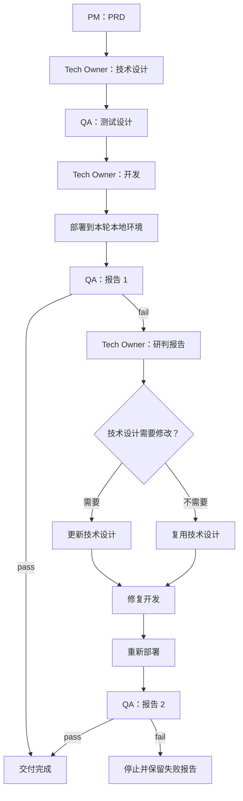

# Single Agent：首次交付与修复 Sprint

依据：[飞书 Single Agent workflow](https://rcnmkynuc7as.feishu.cn/wiki/GsuKwp9JJiTLPckayTwctTjxnic#share-Lb86dSnDHoCEjnxQJjPceWKknNc)，2026-09-20 读取文档 revision 1648 及两张内嵌画板。根据用户后续要求，测试用例只生成一次，修复阶段不更新。执行配置为 [lifecycle.yaml](../tasks/saleor-prd-tdd/workflows/lifecycle.yaml)。

## 推进规则



Sprint 1 有 6 个阶段；Sprint 2 有 5 个阶段：研判、按需更新技术设计、开发、部署和 QA。研判交付 `repair-plan.json`，由 `design_changed` 控制设计更新。设计无需更新时，运行器复制已接受版本并记录 `reused_from`，不调用 Agent。PRD 和测试用例保持原版，两轮 QA 均直接引用 `sprint1/test-design/test-cases.v1.csv`，不生成 v2 用例。修复阶段读取本轮技术设计与上一轮 QA 记录。

画板同时出现“报告 2 / 重试报告 3”和“报告 2 仍有问题则停止”。本版采用画板底部明确的结束条件：最多两轮 QA，不自动生成第三轮。每阶段只执行一次，不做产物内容门禁，不自动补交。

QA 的 `test-verify.json` 中 `verdict` 为 pass 则完成，为 fail 则进入修复；第二轮 fail 以 `qa_failed` 结束，CLI 返回 1。研判只读取 `repair-plan.json` 的布尔值 `design_changed`。不检查报告一致性、CSV 内容、编号引用、模板标题或 Schema 完整性。缺少约定输出文件、工具异常、分支 JSON 无法读取或必要字段无效时，以 `failed` 停止，不重试。

## 会话与角色

Single 在所有执行阶段和修复阶段复用同一原生 `threadId`。每次通过 `thread/inject_items` 追加 developer 消息，再调用 `turn/start`。旧历史保留；新消息明确上一阶段结束、当前 stage/轮次/职责、可写范围和交付条件。同角色跨 Sprint 时会验证原生记录中的 stage 标记。运行器只接受当前 turn 的完成通知。

## 工作区与产物

- PRD 接受后立即冻结；第一轮用例接受后，宿主机生成一次 `workflow/baseline.json`，绑定两者的原始路径、来源阶段和 SHA-256。正式输入只使用这些引用，Agent 在其他目录创建的副本不成为新版本。
- 阶段执行前后、文件收集及部署结束（含异常路径）、设计复用及封存时检查基线。宿主机封存副本、容器内文件或基线清单发生变化即停止运行，不重试，也不更新基线。容器内文件及所属目录沿用 root 持有、不可写的权限；每阶段检查实际 Agent 身份无写权限。
- 本次运行不能切换 PRD 或测试用例版本。发现基线问题可记录在当前报告中；确需修改时，由用户明确决定新建运行。
- `/workspace/repos` 仅在开发阶段可写，其他角色只读；每次接受开发产物时保留完整多仓 `repos.tar`、文件清单、内容/执行位/链接摘要。
- 每个阶段和 Sprint 有独立输出目录。开发提测报告保留在 `sprintN/development/`，部署读取它并在 `sprintN/deploy/` 交付更新版本，QA 使用部署版本。避免覆盖已接受文件。
- `sprint1/qa/test-report.1.md`、`sprint2/qa/test-report.2.md` 及各轮 JSON 分开保存；不存在被覆盖的唯一“当前 JSON”。两轮 QA 使用相同的第一轮用例文件，并分别记录其输入摘要。
- 每个阶段重新分配无特权 UID，阶段结束清理该 UID 的工具、子进程和子 Agent。只读文件和旧产物由 root 持有；输入哈希记录于状态。
- 修复设计不回写第一轮文件；原始技术设计、用例、代码快照和 QA 失败报告均保留。

## 本地部署与测试环境

部署目标固定为本次 Harbor 容器。部署角色交付 `deployment.json`，包含 `prepare`（有序准备命令，可为空）、`services`（前台服务 argv/cwd）和 `healthchecks`（本地 HTTP 地址）。候选源码位于 `/workspace/deployment/repos/`。

运行器清理部署 Agent 的进程后，校验只读源码摘要，删除上一次 deployment 并复制本轮已接受源码，再次校验副本摘要。以独立服务用户执行 prepare 安装依赖、构建和初始化，然后启动 services 并验活。每轮部署都使用全新副本，部署阶段手工遗留的副本不会进入服务。证据记录实际物化源码摘要、轮次阶段、启动声明摘要、PID 和 HTTP 状态，保存 prepare/service 日志。

服务跨 QA 阶段保留，服务用户的 `/tmp`、`/var/tmp` 和 `/dev/shm` 资源不会被阶段清理删除。只清理已退出阶段用户的临时资源；scratch 与阶段用户 home 不可作为服务依赖。进入下一轮开发/部署或 run 退出时停止服务。该机制绑定实际部署输入；构建命令和业务服务正确性仍由开发与 QA 验证。

镜像提供 Python 3.12、Node 22、编译工具、PostgreSQL、Redis 及 Saleor 所需系统库。业务依赖、数据库初始化、迁移、测试数据及具体启动命令由开发/部署阶段根据当前候选准备；没有预置参考实现，没有把机器上其他 Saleor 服务作为测试目标。健康检查证明入口可访问，不证明完整 Saleor 功能正确。

## 使用与验证

```bash
# 默认 Single 完整流程（真实模型，需显式凭据）
python -m runtime --use-local-codex-auth

# 无模型：完整修复链，包括技术设计更新，测试用例保持不变
python -m runtime --smoke --smoke-scenario repair

# 无模型：不改设计，验证设计复用及修复部署
python -m runtime --smoke --smoke-scenario repair-reuse

# 另有 pass（首轮通过）与 fail（第二轮失败，预期退出码 1）
python -m unittest discover -s runtime/tests -t . -v
```

Flat/Hierarchical 只保留同一 lifecycle 契约的声明配置，执行入口明确拒绝。当前不支持断点续跑；失败后保留原运行记录，新建 job。

移除内容门禁前的版本做过无模型单元测试和 SYNTHETIC 容器联调，历史记录见 [验收记录](../reports/checks/single-agent-baseline-verification.json)。尚未进行真实模型的完整 Saleor 开发、部署与 QA rollout。当前 QA 分支只读取 Agent 提交的 verdict，未接入独立业务 verifier。

移除内容门禁前，真实模型文档阶段验证已完成：PRD、技术设计与测试设计均被接受，130 条用例引用覆盖 96 条验收条件，基线摘要一致。该次运行按用户要求在开发前停止；原始 failed 状态来自主动停止拦截，不代表文档验收失败。见 [真实文档验证记录](../reports/checks/single-agent-real-docs-verification.json)。
