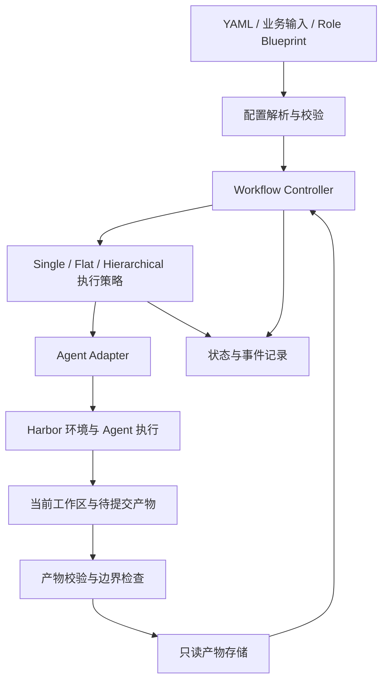
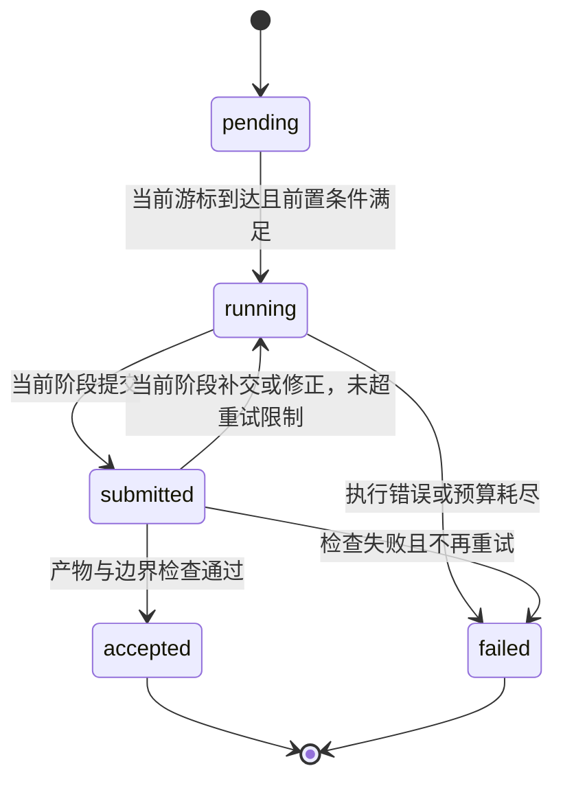

# SDLC Workflow Runtime 设计

2026-09-20 范围更新：当前只做到技术设计交付，已取消额外公共规范和自审步骤。两阶段契约与三模式配置见 [Instruction 到技术设计](instruction-to-review.md) 和 `../tasks/saleor-prd-tdd/workflows/`。下文及 examples/ 保留早期完整生命周期草案；新流程的目录、ID、模板与实际准备能力以前者为准。

状态：设计草案，2026-09-17。本文和 examples 中的 YAML 尚未接入 `run.py`，不是已经实现或验证过的运行能力。本轮只设计，不启动模型，不扩展 Saleor 业务环境。

## 1. 已确认的行为

Role Blueprint 就是角色的 system prompt，定义职责、工作方法、决策边界和交付要求。Workflow 描述何时由哪个角色工作；execution mode 决定 Agent 和上下文的生命周期。

| 模式 | 主 Agent 生命周期 | 上下文与交接 | 推进控制 |
| --- | --- | --- | --- |
| Single | 整个 run 一个主 Agent，可内部使用 sub-agent | 主会话跨 stage、跨 sprint 延续 | 运行器按预定义顺序推进，边界更新当前角色 |
| Flat | 每个 stage 实例新建一个 Agent | 不传前一 Agent 的聊天历史，只交接 workspace 中声明的文件与产物 | 同样按预定义顺序推进 |
| Hierarchical | 一个 Lead 自主招募和组织团队 | Lead 分配任务、上下文和角色，通过团队工具交接 | Lead 自主调度，允许重新进入任意工作类别返修 |

Flat 的阶段本身仍按顺序执行。`sprint1/code` 与 `sprint2/code` 是两个不同 stage 实例，因此对应两个不同 Agent。

每个 sprint 的 stage 列表单独定义。示例为：

```text
索引 0               1                    2                 3               4
sprint1/pm → sprint1/architect → sprint1/code → sprint1/qa → sprint1/deploy
                                                                              ↓
索引 5                          6                    7
sprint2/code       →       sprint2/qa       →       sprint2/deploy
```

Single 用同一个主会话完成这 8 个 stage；Flat 新建 8 个主会话。`sprint1/deploy → sprint2/code` 是正常前进；`sprint1/qa → sprint1/code` 不在合法转移集合中。

## 2. 配置分工与样例

- [roles.yaml](examples/roles.yaml)：角色到 Blueprint 的映射。现有 PM、架构师指向实际文件，其余角色明确标为待编写。
- [fixed-plan.yaml](examples/fixed-plan.yaml)：Single / Flat 共用的 2 个 sprint、8 个 stage、输入引用、输出和准入条件。
- [single.yaml](examples/single.yaml)：持续主会话策略。
- [flat.yaml](examples/flat.yaml)：逐阶段新 Agent 策略。
- [hierarchical.yaml](examples/hierarchical.yaml)：Lead 自主组织策略及最终交付契约。

YAML 是运行器的声明输入；Skill 提供 Agent 可阅读的工作方法，不能改变运行器的状态。Hierarchical 的 Lead 将获得团队组织 Skill，学习怎样调用团队工具。该 Skill 本轮尚未编写。

首版不实现通用 YAML 继承、任意表达式或脚本求值。`plan`、`roles` 引用直接读取指定文件；相对路径以声明它的 YAML 文件所在目录解析。所有文件在运行前解析成一份完整 `resolved-workflow.json`，连同 Blueprint 和业务输入计算哈希并封存。运行途中不热加载修改。

### 引用规则

`input:<name>` 指 run 开始前绑定的外部输入；`artifact:<sprint>/<stage>/<output>` 指当前 run 中已接受的产物。引用必须显式，不支持运行中含义变化的 `latest`。

在固定流程中，编译器展开 stage 列表，并检查产物生产者严格早于消费者、output 名存在、类型匹配、无环、无重复 stage 实例。第二轮可继续引用第一轮的 PRD/TDD，同时以第一轮代码候选为基线。

`base_repos` 绑定现有 Base SHA manifest 和对应源码。`business_brief` 绑定不含参考答案的业务输入；`sprint2_request` 必须有第二轮明确任务，不能仅靠“再跑一次 code”让 Agent 猜测目标。样例使用逻辑绑定，未提供实际第二轮任务。

`deployment_target` 是运行前绑定的本机隔离部署环境描述；云端部署需另外配置目标和凭据。本设计不推断已有实验服务为部署目标。

`checks`、`requires.check` 和 `capture` 使用运行器注册的有限名称；遇到未知名称就拒绝编译。`path` 相对当前输出目录，`capture: workspace.repos` 由运行器生成源码快照，`capture: runner.*` 从受控执行记录收集证据；不能把这些字符串作为任意 shell 表达式执行。示例中的策略组合也需要校验，例如 Single 不能配置 `new_per_stage`，Flat 不能配置跨阶段原生 resume。

## 3. 系统模块与所有权



| 模块 | 所有权与职责 |
| --- | --- |
| Config Compiler | 校验配置，绑定输入，展开固定流程；拒绝不支持的模式与缺失依赖 |
| Workflow Controller | 唯一可以改变当前 stage、接受交付和宣布 run 完成的主体 |
| Execution Strategy | 决定主会话的复用/新建，以及 Lead 的团队调度能力 |
| Agent Adapter | 加载当前角色、开始或恢复原生会话、保存轨迹；不自行推进阶段 |
| Workspace Manager | 从冻结输入装配工作区，控制可写范围、清理跨阶段残留进程 |
| Artifact Store | 保存不可变文件或多仓源码快照，生成哈希和来源关系 |
| Gate Runner | 执行结构检查、变更范围检查及显式配置的运行检查 |
| Ledger | 持久化 stage、session、attempt、工具执行和产物接受事件 |

Controller 运行在 Agent 环境外。Agent 看不到可写的状态文件、产物存储根目录或宿主机 Docker socket。部署相关操作通过受限运行接口执行；不能为方便部署而把整个控制面交给 Agent。

## 4. 三种执行策略

### Single

创建一个稳定的 `principal_agent_id` 和原生主会话。每个 stage 开始时，Controller 发布当前 stage envelope：stage 实例 ID、角色 Blueprint、业务任务、输入 manifest、当前可写范围、输出契约和执行预算。

主 Agent 在当前 stage 内可以多次调用工具、修订当前草稿、组织 sub-agent。阶段提交后，Controller 等待或终止该阶段子任务，撤销旧阶段写权限，检查并封存产物。只有完成这一边界，才更新角色并恢复主会话执行下一阶段。

“同一个 Agent”指主身份和原生会话连续，不要求同一个 CLI 进程永不退出。允许在阶段边界停止 CLI，再用原生 resume 继续。不能只把上一轮摘要塞给全新会话并声称是 Single。上下文压缩属于会话行为，记录其发生情况，不承诺无限保留全部 token。

当前角色指令取代上一阶段的活动角色指令；历史聊天可以保留，但不继续授予旧角色权限。阶段权限由运行器决定，不能依赖模型自行理解“现在换角色了”。

Codex / Claude Code 是否支持在原生 resume 时正确更新活动指令，必须分别做兼容验证。当前薄适配层尚未证明这一点。若某个 adapter 无法做到，就标记不支持 Single，不能静默退化为 Flat。

### Flat

每个 stage 实例创建新的 `principal_agent_id` 和原生会话。上一阶段 Agent 在边界结束，子任务也必须结束。下一 Agent 只收到公共业务输入、自己的角色与任务，以及 YAML 明确指定的已接受产物。

不复制上一阶段原生 session、隐藏记忆、临时笔记和任意残留文件。需要交接的调查说明，应成为明确声明的 handoff 产物。第一版示例关闭 Flat 的 sub-agent；以后若开放，必须作为独立实验参数记录。

Single 和 Flat 使用相同的 stage 输入、输出契约与工作区重建规则，主要差异保持为主会话生命周期，以及显式配置的 sub-agent 策略。

### Hierarchical

Lead 获得业务任务、角色目录、可用工具、预算与最终交付契约。执行计划由 Lead 决定，不把固定模式的 8 个 stage 强加给它。

团队接口拟提供 `spawn_member(role, task, input_refs)`、`send_task`、`inspect_member`、`submit_artifact`、`request_check` 和 `finish_delivery(manifest)`。成员不能绕过 Controller 写入正式产物库。Lead 可以重新分配 code、QA 或设计工作，每次修改产生新版本；过去交付保留原样。

没有固定的 stage cursor；使用有父子关系的 `work_item_id`、role 和 artifact revision 记录实际过程。多轮业务请求可以按 delivery round 提供，round 不是固定阶段表。

Lead 通过 Skill 了解组织方法，通过实际工具完成委派。只写一份“可以招募 Agent”的 Skill 不会自动产生团队能力。结束时仍由运行器检查最终 manifest 的完整性、引用闭包及版本一致性。

## 5. 阶段状态、完成条件与失败

固定模式的 stage 状态：



`submitted → running` 只允许同一 stage 的交付修正；不会返回上游 stage。已接受阶段没有回到 running 的边。

Agent 的完成回复是提交信号，不是自动接受。运行器根据声明收集产物；原生 CLI 正常结束但缺少文件时，按提交不完整处理。

需要区分三个结果：

1. **交付接受**：文件齐全、可解析、来源版本正确、没有越界修改。
2. **业务/运行结果**：例如 QA 的通过、失败或未执行；与“报告已提交”分开。
3. **下一阶段准入**：例如部署要求可信测试执行证据通过，且 QA 对象正是本次代码候选。

因此，QA 可以交付一份有效的失败报告；报告被保存后，deploy 的准入条件不满足，当前 run 停止。不会偷偷修生产代码、跳过 deploy 或自动开始 sprint2。样例中的第二轮是预先安排的后续迭代，第一轮必须满足既定推进条件。

若以后需要“第一轮失败也进入下一 sprint 修复”，应新增明确的分支/跳过语义并单独评审；首版不包含。运行错误、超时、产物错误与业务测试失败分别记录，不能合并成一个“失败分数”。

## 6. 工作区与产物边界

每阶段由冻结输入装配新的工作沙箱。Single 的会话保留，沙箱可以重建；这既清理后台进程，又使 Single / Flat 获得相同的文件输入范围。原生 session 保存在受控独立目录中，Flat 不继承它。

固定目录约定：

```text
/workspace/<repo>/       # 当前阶段允许看到的源码版本
/workspace/input/        # 只读的 PRD、TDD、任务和证据等显式输入
/workspace/output/       # 当前阶段交付目录，保持现有 Role Blueprint 的输出路径
/workspace/scratch/      # 当前阶段临时文件，不自动交接
```

| Stage | 可写范围 | 被保护的输入 | 正式产物 |
| --- | --- | --- | --- |
| PM | 当前输出和临时文件 | Base 源码 | PRD |
| 架构师 | 当前输出和临时文件 | Base 源码、PRD | TDD、按需附接口文件 |
| Code | 当前候选工作树、输出和临时文件 | 已接受的 PRD/TDD、上游源码快照 | 多仓候选快照、开发测试证据、实现交接 |
| QA | QA 测试工作区、报告和临时文件 | 固定生产代码候选、PRD/TDD | 测试套件、运行证据、QA 报告 |
| Deploy | 部署配置、运行记录和指定隔离目标 | 已通过检查的候选、QA 证据 | 部署配置、部署清单、健康检查证据 |

QA 如需在源码目录布局下执行测试，使用可写测试覆盖层/独立测试工作副本。相对候选的差异仅允许在批准的测试范围内；生产文件、依赖与构建配置变化不能夹在 QA 测试补丁中。正式 candidate 的哈希始终不变，部署使用该候选，不从 QA 的临时工作区随意打包。

只写 prompt 或 `chmod` 不足以形成强边界，当前容器以高权限运行且网络开放也不具备这些保证。实现时需要只读挂载、无特权运行、阶段凭据撤销和宿主机侧差异检查。运行器拒绝越界交付是一层控制；限制实际写入是另一层控制，两者都要验证。

Sub-agent 继承当前阶段的读写范围和 `stage_epoch`，不能推进 workflow。阶段关闭后旧 epoch 的提交和工具请求均拒绝，旧进程不能继续在新阶段写文件。

## 7. 产物模型与版本一致性

一个正式产物至少包含：

```yaml
artifact_id: sprint1/code/candidate
revision: 1
type: repository_snapshot
producer: {stage: sprint1/code, attempt: 1, agent_id: agent-001}
digest: sha256:<内容哈希>
input_digests: {source: sha256:<上游源码>, prd: sha256:<PRD>, tdd: sha256:<TDD>}
storage_uri: artifacts/<digest>
```

manifest、digest、时间戳与接受状态由运行器生成。Agent 提交的同名字段只能作为声明，不作为控制真值。哈希覆盖相对路径、文件内容、可执行位和符号链接目标；收集时拒绝逃逸输出根目录的路径/链接，避免误收宿主机或密钥文件。

代码候选是跨仓版本集合，不能只用一个未关联工作树内容的 commit 字符串表示。部署记录至少绑定候选 digest、QA 证据 digest、实际镜像/制品标识和目标环境。

QA 的测试列表、测试套件 digest、执行命令、退出码、stdout/stderr 与候选 digest 由受控执行接口捕获。部署检查证据同时绑定正式候选和正式测试套件，避免测试后再换代码或测试文件。Agent 自己写 `passed: true` 不足以通过部署门槛。测试覆盖率与文档内容质量仍是另一个问题，首版不把结构检查宣传为质量评测，也不要求 Oracle/Noop。

Hierarchical 使用相同的版本模型，允许再次提交新 revision；Lead 最终选定一组兼容版本。新 code revision 会使旧 QA/部署证据不再适用于新候选，必须重新检查，不能把旧的通过结果沿用到新代码。

## 8. 持久化、中断与恢复

```text
workflow-runs/<run-id>/
  resolved-workflow.json
  input-manifest.json
  state.json
  events.jsonl
  sessions/<agent-id>/
  stages/<sprint>/<stage>/attempts/<n>/
    instruction.md
    role-blueprint.md
    input-manifest.json
    transcript/
    checks.json
    submission-manifest.json
  artifacts/<digest>/
  final-manifest.json
```

外部 Controller 是唯一状态写入者。首版使用单进程锁、追加事件日志和原子替换的状态快照；事件记录包含递增序号。接受步骤先写入临时产物目录、校验和原子封存，再追加 `stage.accepted` 事件并更新游标。恢复以持久化事件为准，临时目录和未被接受事件引用的对象不算正式产物。

已 accepted 的 stage 恢复时直接复用，不重新调用模型。running 的 stage 先核对会话及未完成工具操作，再选择同 stage 恢复或新 attempt；保持先前 attempt 的证据。Single 若丢失可恢复的原生会话，应停止并报告不支持继续，不能悄悄新建主会话。

阶段接受采用幂等键 `(run_id, stage_id, attempt_id, submission_digest)`。一次提交只接受一次。部署等外部副作用不能保证天然 exactly-once：使用发布 ID 和操作日志，超时后先查询目标实际状态，再决定是否重试，不能盲目重复部署。

## 9. 与本机 Harbor 的接入

2026-09-17 只读检查了本机 Harbor 0.20.0 的 `harbor/trial/multi_step.py`、`harbor/trial/trial.py` 和 `harbor/models/task/config.py`：

- 已有顺序 steps、阶段 timeout、artifacts、healthcheck 和阶段日志归档。
- `resume_trajectory` 控制后续 step 是否调用同一 Agent 的 `resume`；step 模型没有独立的 Blueprint 字段。
- 默认多阶段实现复用 Agent 对象和环境，仅启用 steps 不能自动获得这里的角色切换与写入隔离。
- 关闭 verifier 时，依赖 verifier reward 的阶段门槛不会承担本文的交付控制。

因此采用外部 Controller 统一持有 workflow 状态，复用 Harbor 的环境和 Agent 生命周期接口；避免修改本机安装包。Flat 可以把每个阶段映射为独立执行单元；Single 需要一个跨阶段持有原生 session 的执行策略，不能简单连续调用当前 `run.py`，因为它每次新建运行。

当前 `agents.py` 在构造时固定 prompt，需增加 `activate_role(stage_envelope)`；在阶段边界更新活动指令并保存实际注入内容。当前 `run.py` 固定一个 task 并检查 PRD、TDD 两份文件，需由 stage 输出契约替代硬编码检查。现有单轮入口保持可用，另设 workflow 入口。

当前联合任务的 instruction 同时要求 PRD/TDD。实现时拆出公共业务 brief，再由 Controller 生成当前角色的 stage instruction；不能把联合交付要求原样交给只负责 PM 的 stage。架构师收到显式 PRD 输入路径，不要求它从新的 output 目录猜测上一阶段文件。

## 10. 实施分段与验收

### A. 配置与无模型状态机

实现配置解析、引用校验、固定顺序、产物库、事件记录和 dry-run。使用模拟执行器验证 8 个 stage 的调度、跨 sprint 引用、拒绝回退、重复提交幂等与中断恢复。这是 harness 检查，不是 Oracle/Noop。

### B. PM → 架构师最小闭环

先接 Flat，验证独立会话与 PRD 交接；再接 Single，验证原生会话延续、角色更新、旧 stage 权限撤销。用第二轮的简化文档任务验证跨 sprint 行为。只有在明确配置模型后才做真实调用；dry-run 不调用模型。

### C. Code → QA → Deploy 与第二轮

补齐三个 Role Blueprint、可构建的 Saleor 依赖环境、测试数据与本机隔离部署目标。验证代码快照、QA 测试范围、可信执行证据和同一候选部署。按 5+3 阶段示例跑全流程。

### D. Hierarchical

补 Lead Blueprint、团队组织 Skill 和真实团队管理接口。验证自由返修、新 revision、证据失效和最终交付闭包。保留与固定模式一致的输入、环境版本和产物规则。

### 必须覆盖的行为

| 场景 | 预期 |
| --- | --- |
| 两 sprint 为 5+3 stage | 展开为唯一的 8 步序列 |
| Single 成功执行 | 一个主 Agent 与原生会话持续，记录 8 次角色激活 |
| Flat 成功执行 | 8 个不同主 Agent；跨阶段没有 session 文件继承 |
| QA 请求返回同 sprint/code | 拒绝，不改变 cursor |
| sprint1/deploy 完成 | 下一步为 sprint2/code |
| 缺 PRD / 引用未来产物 / 未定义角色 | 编译或准入失败，不启动依赖阶段 |
| QA 偷改生产代码 | 实际写入被限制；提交差异检查拒绝越界变更 |
| QA 报告完成但测试失败/未执行 | 保存报告；部署准入失败，停止该 run |
| 旧 sub-agent 延迟提交 | stage epoch 已失效，拒绝 |
| accepted 后进程崩溃 | 恢复后不重复执行已接受阶段 |
| Single resume 无法正确切换角色 | adapter 标为不支持，不用 Flat 冒充 |
| Hierarchical 修复代码 | 产生新 candidate revision，旧 QA 证据不可复用 |

当前待补内容：开发/QA/部署/Lead Blueprint、Lead Skill、实际第二轮任务、业务运行依赖和部署绑定。它们在设计样例中显式留空；不是要求现在立即决定所有细节，也不能在实现时静默采用生产环境。

## 11. 本轮设计检查

已检查 5 份 YAML 可解析且无重复键；固定计划包含 8 个 stage 实例、20 个输出、31 处对更早阶段产物的引用，没有未来引用。Single / Flat 引用同一计划，已有 Blueprint 路径与文档相对链接可定位。

这只是配置草案的一致性检查。运行器、角色动态切换、写入隔离、团队工具和真实模型流程均未在本轮实现或验证；现有 `verification.json` 仍仅代表此前的单轮环境安装验证。
